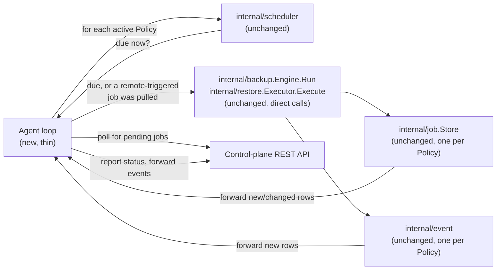
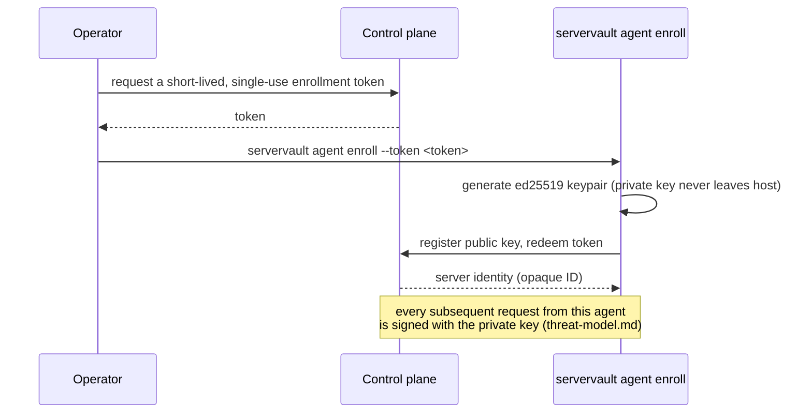

# Agent architecture

**Status:** design only — see [`control-plane-architecture.md`](control-plane-architecture.md)
for how this fits the wider platform and why these documents exist now.
Nothing below is implemented.

## What the agent is

The agent is **not a new codebase**. It is the same `servervault`
binary, given a new long-running subcommand — `servervault agent run`
— alongside the existing one-shot commands (`backup`, `restore`,
`doctor`, ...). This is the direct consequence of
`control-plane-architecture.md`'s rule: the platform must never grow a
second implementation of backup/restore logic.

```text
servervault backup            # one-shot, today, unchanged
servervault restore ...       # one-shot, today, unchanged
servervault agent run         # new: long-running, this document
servervault agent enroll ...  # new: one-shot, registers this host
servervault agent status      # new: one-shot, local introspection
```

`servervault agent run` links the CLI binary against nothing that
`servervault backup` doesn't already link against, plus a thin polling
loop and an HTTP client. It does not open a listening port (see
"Communication model" below).

## Execution model



The only genuinely new code is the **loop**: it decides *when* to call
`Engine.Run`/`Executor.Execute` (from `internal/scheduler`'s existing
calculation, or from a job pulled off the API) and it forwards the
resulting local job/event rows upstream. It contains no backup or
restore logic itself.

### Multiple policies, one agent process

One agent process can run **N policies** concurrently — this is how
"multiple backup policies" and "multiple repositories" per server work
without any change to `internal/config`, `internal/job`, or
`internal/lock`: each `Policy` (see [`data-model.md`](data-model.md))
resolves to one `*config.Config`-shaped value, and everything below the
agent loop operates per-`Config` exactly as it does for a single CLI
invocation today:

- One `Backup.LockFile` / `Restore.LockFile` per policy (already a
  config field — no schema change; policies just get distinct paths).
- One `job.Store` per policy (already `job.Open(path)` — multiple
  stores are multiple paths, not new code).
- One `event` sink per policy, same reasoning.

Two policies on the same agent can therefore run concurrently without
contending on each other's locks, exactly as two differently-configured
hosts would today — the agent just happens to be evaluating both
schedules in the same process.

## Standalone vs. managed

| | Standalone (today) | Managed (this document) |
| --- | --- | --- |
| Trigger | `cron`/systemd timer runs `servervault backup` | Agent loop evaluates `internal/scheduler` itself, or a job arrives from the API |
| Network calls | None beyond the Restic backend / PostgreSQL socket | + polling the control plane, + forwarding job/event rows |
| Job/event storage | Local SQLite, as today | Same, unchanged — plus forwarded upstream |
| Failure mode if network is down | N/A | Backup/restore still runs and completes locally; only the upstream report is delayed/retried. A network outage never blocks or fails a local job. |

The second row of that last line is load-bearing: the agent must
**never** make local execution conditional on control-plane
reachability. If the API is unreachable, the agent behaves like a
Standalone host for that cycle and queues its local job/event rows to
forward once connectivity returns. This is the daemon-mode expression
of `control-plane-architecture.md`'s "the CLI never needs the control
plane to work" rule.

## Communication model: pull, not push

The agent **polls** the control plane for pending jobs and pushes
status/event updates on its own outbound connections; the control plane
never opens a connection *into* an agent.

Why, explicitly:

- A backup host is a high-value target (it has PostgreSQL peer-auth
  access and, per `CLAUDE.md`, is "trusted to run as root against
  production"). Giving it an open listening port would be a new inbound
  attack surface with no equivalent today — the shell implementation
  and the current CLI have never listened on a socket. Pull-only keeps
  that invariant.
- Pull-only means agents work unmodified behind NAT/firewalls with no
  inbound rule, matching how these hosts are actually deployed
  (`docs/deployment.md`'s Hetzner/SSH-outbound example has no inbound
  service today).
- `threat-model.md`'s Denial-of-service row ("compromised agent floods
  the job queue") is easier to rate-limit against a poll endpoint
  (control plane controls the response cadence) than against a push
  model where the agent's own listener is the thing under load.

Bounded exponential backoff on poll failure reuses
`internal/scheduler.RetryPolicy` (already implemented, already
DST/jitter-correct) rather than inventing a second retry mechanism.

## Enrollment

Reuses `threat-model.md`'s already-decided mechanism; this section adds
the flow, not new decisions:



The token is redeemed exactly once; a leaked token that's already been
used grants nothing. The private key is generated on the host and never
transmitted, matching `threat-model.md`'s "fake or stolen agent
identity" mitigation.

Enrollment does not read, modify, or migrate the host's existing
`servervault.yaml`, job history, or event history — it registers a new,
separate control-plane identity for a host that may already have months
of local Standalone history. `HostTag` (see `data-model.md`) is what
lets the control plane correlate that pre-existing local history to the
newly enrolled server, by value, without rewriting it.

## What does not change for the agent

Restated from `threat-model.md`'s "what does not change" section,
because it applies to this document specifically:

1. The agent's job executor only ever calls typed Go functions
   (`Engine.Run`, `Executor.Execute`) — there is no code path from "job
   arrived over the network" to "shell command runs." The job payload
   the agent receives is one of the closed set of typed requests defined
   in [`api-design.md`](api-design.md#job-submission-is-a-closed-vocabulary),
   never a command string.
2. A remote-triggered restore is bound by exactly the same safety rules
   as a local one: staging-first, temp-DB-first, no code path that
   accepts or defaults to a live path or live database. Nothing about
   arriving over the network relaxes `internal/restore`'s guarantees —
   the agent calls the identical `Executor.Execute`.
3. A Restic repository is never deleted automatically, whether the
   trigger was local or remote.
4. `internal/execx`'s argv-only invocation is the only way the agent
   (like the CLI) ever runs an external command.

## Local introspection without the control plane

`servervault agent status` reads the agent's own local
`internal/job`/`internal/event` stores and its last-successful-poll
timestamp — it works whether or not the control plane is currently
reachable, for the same "never depend on the network" reason as
execution itself.
