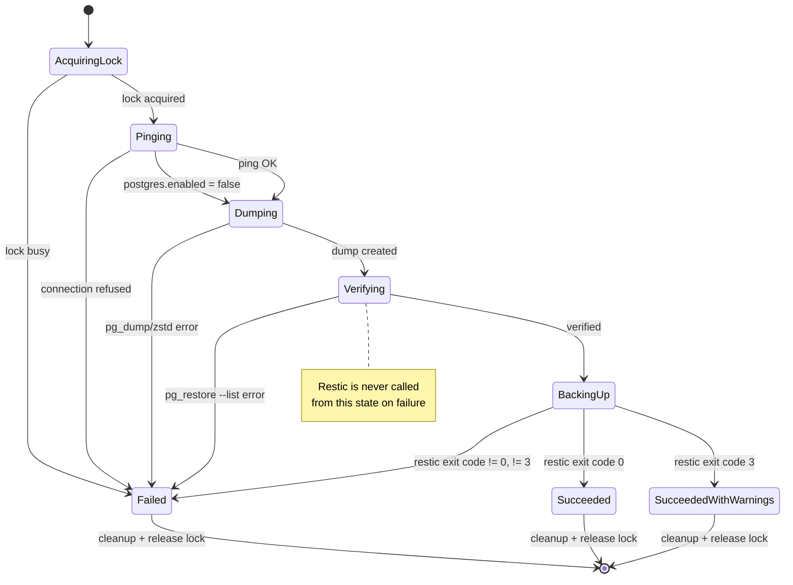

# Backup flow

This describes the `servervault-backup` shell script (`main`) and, below,
the Go rewrite's `servervault backup` (`go-rewrite`, v0.3.0 Phase A),
which follows the same flow through `internal/backup`, `internal/postgres`,
and `internal/restic`.

## Steps

1. **Load configuration.** Source `/etc/servervault/servervault.env`
   (or `$SERVERVAULT_CONFIG`). Abort if it is missing or unreadable.
2. **Acquire the lock.** Take an exclusive `flock` on
   `/run/lock/servervault-backup.lock`. If another backup is running,
   exit immediately rather than queueing or overlapping — see
   [`docs/security-model.md`](security-model.md) for why concurrent
   backups are refused rather than serialized.
3. **Preflight.** Confirm `restic`, `pg_dump`, `pg_restore`, and `zstd`
   are on `PATH`, and that PostgreSQL is reachable
   (`SELECT 1` round-trip).
4. **Dump the database.** `pg_dump --format=custom --no-owner
   --no-privileges`, piped directly into `zstd` (streaming; the
   uncompressed dump never touches disk).
5. **Verify the dump before it is trusted.** Test the Zstandard frame
   (`zstd -t`), decompress to a temporary file, and confirm
   `pg_restore --list` can read it. The temporary file is removed
   immediately after.
6. **Back up files and the dump together.** A single `restic backup`
   call covers the configured `BACKUP_PATHS` plus the verified dump,
   tagged with `servervault` and the server's host tag, and using the
   configured exclude file.
7. **Apply retention.** `restic forget --keep-daily --keep-weekly
   --keep-monthly --prune`, scoped to the current host tag so multiple
   hosts sharing a repository don't prune each other's snapshots.
8. **Verify the repository.** `restic check` after pruning, so a
   corrupted repository is caught the same run it happened, not on the
   next scheduled `servervault-verify`.
9. **Report.** Print the five most recent snapshots for the host.
10. **Clean up.** A `trap ... EXIT` removes the local compressed dump
    file regardless of success or failure, so backup runs don't
    accumulate local disk usage.

## Failure behavior

Every step uses `set -Eeuo pipefail`, so the script stops at the first
failing command — a failed dump never gets backed up as if it
succeeded, and a failed `restic backup` never gets pruned as if it
completed. Nothing here deletes the Restic repository itself; `forget
--prune` only removes snapshots outside the retention window, and only
after the backup step succeeded.

## Scheduling

`systemd/servervault-backup.timer` runs the backup once daily
(`OnCalendar=*-*-* 03:00:00`) with a randomized delay, via
`systemd/servervault-backup.service`. Independently,
`servervault-verify.timer` runs `restic check --read-data` on its own
schedule — see [`docs/deployment.md`](deployment.md).

## Go engine (`go-rewrite`, v0.3.0 Phase A)

`servervault backup` runs the same steps through typed Go packages instead
of shell commands: `internal/lock` (locking), `internal/postgres` (dump +
verify), `internal/restic` (backup), orchestrated by
`internal/backup.Engine.Run`. Two differences worth calling out from the
shell version:

- **Retention is not run here.** `internal/backup` never calls `restic
  forget`/`prune` — that's `internal/retention`, a later milestone
  (`ROADMAP.md` v0.4.0). Phase A backs up; it doesn't prune.
- **Restic exit code 3** ("some source files could not be read," e.g. a
  vanished or permission-denied file) is treated as a successful backup
  with a warning, not a hard failure — see the state diagram below. Every
  other non-zero Restic exit is a hard failure.

### State flow



Every terminal transition passes through the same cleanup: the local dump
file is removed and the lock is released, regardless of which state the
run ended in — see the failure/cleanup matrix in the Phase A design notes
(recorded in `AI_MEMORY.md`).

### Sequence (PostgreSQL enabled)

```mermaid
sequenceDiagram
    participant CLI as servervault backup
    participant Engine as internal/backup.Engine
    participant Lock as internal/lock
    participant PG as internal/postgres.Client
    participant Restic as internal/restic.Repository

    CLI->>Engine: Run(ctx)
    Engine->>Lock: TryAcquire(lock_file)
    Lock-->>Engine: acquired
    Engine->>PG: Ping(ctx)
    PG-->>Engine: ok
    Engine->>PG: Dump(ctx, dump_dir)
    Note over PG: pg_dump | zstd, piped,<br/>written to a 0600 temp file
    PG-->>Engine: Metadata{Path, Bytes}
    Engine->>PG: VerifyDump(ctx, path)
    Note over PG: zstd -dc > tmp;<br/>pg_restore --list tmp;<br/>tmp always removed
    PG-->>Engine: ok
    Engine->>Restic: Backup(ctx, paths+dump)
    Restic-->>Engine: Summary{SnapshotID, ...}
    Engine->>Lock: Release()
    Engine-->>CLI: Result{SnapshotID, Duration, ...}
```
