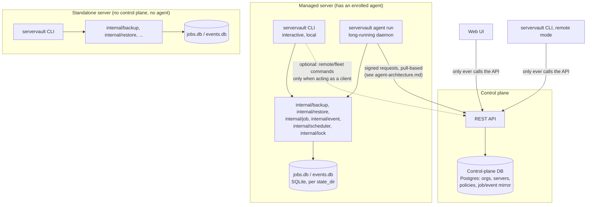

# Control plane architecture

**Status:** design only. Nothing in this document exists yet — no
control plane, no agent daemon, no web UI, no REST API. See
[`ROADMAP.md`](../ROADMAP.md)'s "Beyond v1.0.0" phase table (Phases
0–10) for sequencing; this document is the architectural detail behind
that table's Phases 1–7, written now (ahead of Phase 2 starting) at the
architecture owner's request, per this repo's convention that a design
doc precede the code it governs. It does not change `ROADMAP.md`'s
milestones or their order.

This is one of five companion documents produced together:
[`api-design.md`](api-design.md), [`agent-architecture.md`](agent-architecture.md),
[`data-model.md`](data-model.md), [`extensibility.md`](extensibility.md).
Read this one first — it sets the vocabulary and the one rule the other
four are written against.

## The one rule everything else follows

**The CLI never needs the control plane to work.** Every backup and
restore capability that exists today (`servervault backup`,
`servervault restore`, `servervault snapshots`, `servervault doctor`,
`servervault config validate`) keeps working, unmodified, on a single
host with no network dependency beyond Restic's own backend
(`local:`/`sftp:`/etc.) and PostgreSQL's local socket. This is not a
migration-period compatibility shim — it's the permanent shape of the
system. A single-server operator who never enrolls with a control plane
is not a degraded user of a "real" platform product; they are running
ServerVault exactly as designed, forever.

Everything the platform adds — the agent daemon, the REST API, the web
UI, multi-server/org/policy management — is **additive orchestration on
top of** that unchanged core, never a replacement for it and never a
second implementation of it. Concretely:

- The **agent** is the same `servervault` binary in a long-running mode
  (`servervault agent run`, see [`agent-architecture.md`](agent-architecture.md)).
  It calls `internal/backup.Engine.Run` / `internal/restore.Executor.Execute`
  directly — the exact functions the interactive CLI calls. There is no
  second "networked backup engine."
- The **web UI** has zero direct access to any `internal/` package, any
  local filesystem, or any host. It only ever talks to the REST API —
  the same API the CLI optionally talks to when acting as a remote
  client (see [`api-design.md`](api-design.md)). This is what "Web UI is
  an orchestration layer" means concretely: it orchestrates by calling
  the same API surface everything else calls, it does not execute
  anything itself.
- The **control plane's data model** aggregates and cross-references
  each agent's local `internal/job`/`internal/event` history; it does
  not replace those packages or change their schemas. See
  [`data-model.md`](data-model.md)'s compatibility contract.

If a future requirement can't be satisfied without breaking this rule,
that is a signal the requirement needs to be re-scoped, not that the
rule should bend.

## Component diagram

Note what has **no arrow**: the web UI has no line to any agent, any
server, or `internal/`. The control plane has no line into a server's
filesystem or database beyond what the agent itself chooses to report
through the API. Nothing outside a server can reach into it except
through the agent it enrolled — there is no reverse channel where the
control plane opens a connection into a server.

## Deployment modes

| Mode | What exists | CLI behavior |
| --- | --- | --- |
| **Standalone** (today, and forever) | Nothing but the CLI and its config file | Runs entirely locally. `restic`/`pg_*` are the only external processes. |
| **Managed, agent only** (Phase 2–3) | + agent daemon, enrolled to a single-server control plane | Local commands unchanged. Agent additionally executes scheduled/remote-triggered jobs via the same functions. |
| **Managed, fleet** (Phase 5+) | + multiple enrolled servers under one control plane | Any enrolled server's CLI can optionally query/trigger jobs on *other* servers via the API (a distinct command surface, see `api-design.md`), but its own local commands still never require the API. |
| **Managed, multi-org** (Phase 6+, future) | + organizations, RBAC | Same as fleet, scoped by the caller's org membership. |

A server can be upgraded from Standalone to Managed by enrolling an
agent (Phase 4's secure enrollment flow) without touching its existing
config, job history, or schedules — enrollment adds a control-plane
identity alongside what's already there, it does not migrate or replace
it.

## Package reuse

Every package below is reused **as-is**. None of them gain a
network-awareness they don't already have; the platform layer wraps
them instead.

| Package | Role today | Role in the platform | Changes needed |
| --- | --- | --- | --- |
| `internal/backup` | `Engine.Run` orchestrates one backup | Called identically by the agent for a scheduled/remote-triggered job | None |
| `internal/restore` | `Planner`/`Executor` for one restore | Called identically by the agent for a remote-triggered restore | None |
| `internal/job` | Local SQLite job lifecycle, one `state_dir` per host | Unchanged; the agent reads it to report status upstream | None (see `data-model.md`) |
| `internal/event` | Local SQLite append-only events | Unchanged; the agent forwards new events upstream | None |
| `internal/scheduler` | Pure schedule/next-run calculation | Same calculation, invoked by the agent's own loop instead of (or alongside) `servervault-backup.timer` | None |
| `internal/lock` | `flock`-based concurrency guard, one lock file per host | Same guard; a Policy's lock file path is just another config value | None |
| `internal/config` | One `Config` per invocation | One `Config`-shaped value per Policy on an agent (see `data-model.md`) | None to the type itself |
| `internal/execx` | argv-only subprocess execution | Unchanged — the agent has no new subprocess surface beyond what backup/restore already run | None |
| `internal/restic`, `internal/postgres` | CLI-tool wrappers | Unchanged; become the reference implementation behind `extensibility.md`'s backend interface | None (thin adapter added alongside, not inside) |
| `internal/doctor` | Non-destructive local checks | Unchanged; agent can expose its doctor output over the API as a read model | None |

Nothing in this table gets a `ServerID`, `OrgID`, or `PolicyID` field
bolted onto it. Multi-server/org/policy identity is attached at the
point where the agent talks to the control plane, not inside these
packages — see `data-model.md`'s compatibility contract for exactly how.

## Rollout, mapped to the existing phase table

`ROADMAP.md`'s Phase 0–10 table is authoritative; this just adds the
architectural shape to each phase this document set covers:

| Phase | Scope (from `ROADMAP.md`) | What this document set specifies |
| --- | --- | --- |
| 2 | Local agent service | `agent-architecture.md`: execution model, standalone-vs-managed, enrollment |
| 3 | Single-server control plane | `api-design.md` + `data-model.md`, scoped to one server, no org concept exercised yet |
| 4 | Secure enrollment and remote jobs | `agent-architecture.md`'s enrollment flow; `api-design.md`'s signed-request auth for agents |
| 5 | Multi-server management | `data-model.md`'s `Server`/`Policy` entities exercised for real; still single-org |
| 6 | Organizations, projects, RBAC | `data-model.md`'s `Organization`/`User` entities (schema present from Phase 3 on, per its "multi-tenancy readiness" section); enforcement is its own future `authorization.md` |
| 7 | Web dashboard | `api-design.md` consumed by a UI client; no new backend concept |
| 8 | Notifications, metrics, audit logs | `extensibility.md`'s notification-channel plugin design; metrics/audit logs remain future `observability.md` |
| 9 | Restore workflows and approvals | Builds on `api-design.md`'s restore endpoints; approval workflow itself is future design, not specified here |
| 10 | Production hardening and RC | Future `production-deployment.md`, `upgrade-and-rollback.md` |

## Deliberately not designed here

Consistent with this repo's stated reason for not writing these
speculatively (`ROADMAP.md`: "each gets written at the start of its own
phase, against real code, instead of speculatively now where it would
only drift"), the following remain **out of scope** for this document
set, on purpose:

- `authentication.md` — human login mechanics beyond what
  `threat-model.md` already commits to (Argon2id, lockout, optional
  TOTP). Exact session/token format is a Phase 3 implementation
  decision.
- `authorization.md` — the actual RBAC permission matrix beyond the
  `backup:*`/`restore:*` shape `threat-model.md` already names. Full
  enforcement design belongs to Phase 6.
- `multi-tenancy.md` — cross-org isolation *enforcement* (query
  scoping, tests). `data-model.md` makes the schema tenancy-ready;
  enforcement is Phase 6.
- `observability.md` — metrics/tracing/audit-log query design. Phase 8.
- `production-deployment.md`, `upgrade-and-rollback.md` — control-plane
  operational docs. Phase 10.
- `control-plane-backup.md` — how the control plane's own database gets
  backed up. Written once there's a control plane to back up.

`threat-model.md`'s STRIDE table already commits to the security-shape
of each of these ahead of time; nothing above contradicts it.
