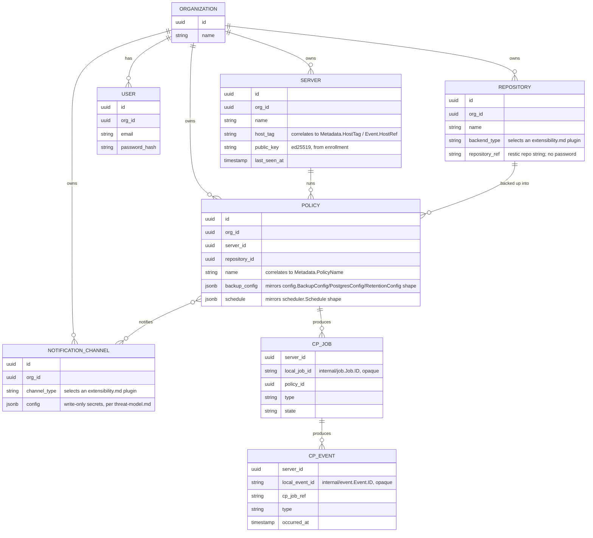

# Data model

**Status:** design only — see [`control-plane-architecture.md`](control-plane-architecture.md)
for how this fits the wider platform. Nothing below is implemented; no
table listed here exists.

## Two tiers, on purpose

| | Local | Control plane |
| --- | --- | --- |
| Storage | SQLite, one file per `state_dir`, one per host (as today) | Postgres, one database, shared |
| Owned by | `internal/job`, `internal/event` (unchanged) | New tables, this document |
| Source of truth for | What actually happened on *this* host | Cross-server aggregation, org/policy/server metadata |
| Exists when | Always — even Standalone, even if the control plane is never built | Only once Phase 3 lands |

This split is not a caching strategy layered on top of a single
"real" schema — it is two genuinely separate schemas with a narrow,
explicit correlation contract between them (below). The local schema
was designed and tested before any platform requirement existed, and
this document's job is to design *around* it, not extend it.

## Compatibility contract: `internal/job` and `internal/event` are frozen

This is the load-bearing constraint the requirements named explicitly
("job/event model must remain unchanged"). Here is exactly what that
means, field by field, as they exist today:

```go
// internal/job/job.go — unchanged by this document.
type Metadata struct {
    SnapshotID   string
    DatabaseName string
    PolicyName   string
    TargetPath   string
    HostTag      string
    BytesTotal   int64
    FilesNew     int
    FilesChanged int
}

type Job struct {
    ID            string
    Type          Type // "backup" | "restore" | "prune"
    State         State
    Metadata      Metadata
    ErrorCategory ErrorCategory
    ErrorSummary  string
}
```

```go
// internal/event/event.go — unchanged by this document.
type Metadata struct {
    SnapshotID, DatabaseName, PolicyName, TargetPath string
    BytesTotal                                       int64
    FilesNew, FilesChanged                           int
    DurationMS                                       int64
    ErrorCategory, ErrorSummary                       string
}

type Event struct {
    ID        string
    Type      Type
    Timestamp time.Time
    JobID     string
    HostRef   string
    Severity  Severity
    Metadata  Metadata
}
```

No field is added, renamed, or repurposed. This isn't just policy — it
follows from `internal/job`'s own documented design: `Metadata` is
"a closed set of typed fields, not a free-form map[string]string...
there is deliberately no generic key/value setter... If a future job
type needs to record a new safe fact, add a new named field here — do
not add a generic map." A `ServerID`/`OrgID` field bolted onto `Job` or
`Event` would violate that package's own stated design and would be
wrong for the same reason a generic map would be wrong.

**Two fields already do the correlation work**, without any change:

- `Metadata.PolicyName` (job) / `Metadata.PolicyName` (event) — already
  a free-text field today (currently unused by any caller, but already
  part of the schema). The control plane's `Policy.name` is what an
  agent stamps into this field when it calls `Engine.Run`/
  `Executor.Execute` for that policy.
- `Metadata.HostTag` (job) / `Event.HostRef` (event) — already a
  free-text field/column today (`internal/backup` already threads a
  configurable `host_tag` through; see the CI log lines like
  `host_tag=""` from `servervault backup`'s own structured logging).
  The control plane's `Server.host_tag` is the same string, set to
  match.

Correlation is therefore **by value equality on two strings that
already exist**, done by the agent (it knows which policy and which
server it's running as) and by the control plane (it stores the same
strings on `Policy`/`Server`). No migration, no new column, no change
to either package's public API.

## Local → control-plane flow

```mermaid
sequenceDiagram
    participant Local as internal/job + internal/event<br/>(local SQLite, unchanged)
    participant Agent
    participant CP as Control-plane DB (Postgres)

    Local->>Agent: new/changed Job row, new Event rows<br/>(read via existing Store API)
    Agent->>CP: POST /agent/report<br/>{ local_job_id, policy_name, host_tag, ...same fields... }
    CP->>CP: upsert into cp_jobs, keyed by (server_id, local_job_id)
    Note over CP: local_job_id + server_id is the only new identifier;<br/>internal/job.Job.ID is never reused as a global primary key
```

`Job.ID` (local) is a per-host identifier (already true today — it's
never been globally unique across hosts, because there was never more
than one host to be unique across). The control plane's primary key for
its job mirror is `(server_id, local_job_id)`, a composite the control
plane owns entirely — `internal/job` never needs to know it exists.

## Control-plane entities (new)



Notes on specific entities:

- **`Repository.repository_ref`** stores the Restic repository string
  (e.g. `sftp:host:path`) — never the password. Matches
  `threat-model.md`'s "write-only secret fields; encryption at rest for
  control-plane-held credentials." The password stays where it is today
  (a local file the agent's host reads directly), or, if centrally
  managed later, is a write-only field never returned by any read
  endpoint — that decision belongs to a future secrets-management
  design, not this document.
- **`Policy.backup_config`** is stored as structured JSON shaped like
  today's `config.BackupConfig`/`PostgresConfig`/`RetentionConfig` —
  not a new configuration language. When an agent executes a policy, it
  materializes this JSON into the exact same `*config.Config` value
  `config.Load` produces from YAML today, and calls `Engine.Run` with
  it exactly as the CLI does. The control plane is an alternate *source*
  of a `Config` value, never an alternate *consumer* of one.
- **`CP_JOB`/`CP_EVENT`** are explicitly named as mirrors (`cp_` prefix)
  precisely so nobody mistakes them for a replacement of
  `internal/job`/`internal/event` — they are queryable copies, keyed by
  `(server_id, local_*_id)`, with no independent lifecycle: a row here
  never exists before its local counterpart did.

## Multi-tenancy readiness (not enforcement)

`org_id` is present on every control-plane entity from the start — this
avoids the breaking schema migration a later-bolted-on `org_id` would
require. It is **not** enforced yet: there is no row-level security, no
cross-org query test suite, no permission check tying a `User` to what
`org_id`s they may query. That is Phase 6 (`ROADMAP.md`) and its own
future `authorization.md`, matching `threat-model.md`'s "Information
disclosure: Cross-tenant data access" row, whose planned mitigation
("mandatory tenant-scoped repository queries + an automated cross-tenant
test suite") is exactly what that future document specifies. Before
Phase 6, every entity's `org_id` can safely default to a single,
implicit organization — the schema doesn't change when that stops being
true.

## What happens if the control plane disappears

Every local `internal/job`/`internal/event` row survives untouched — it
was never the control plane's data to begin with. The only loss is the
`cp_jobs`/`cp_events` mirror and the org/policy/server metadata built on
top of it. Re-enrolling a server and re-forwarding its local history (a
bulk version of the same `/agent/report` flow) is sufficient to rebuild
the mirror; nothing about local execution was ever at risk. This is the
data-model-level proof of `control-plane-architecture.md`'s central
claim.
