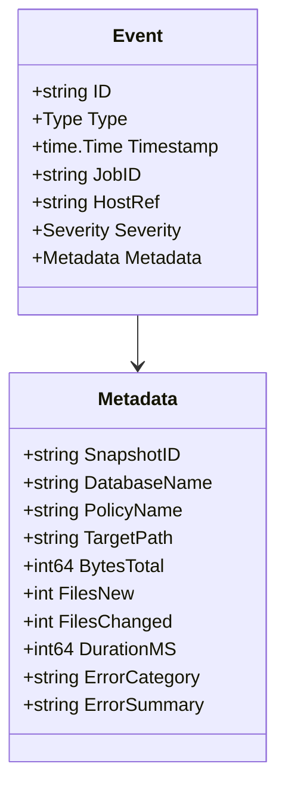
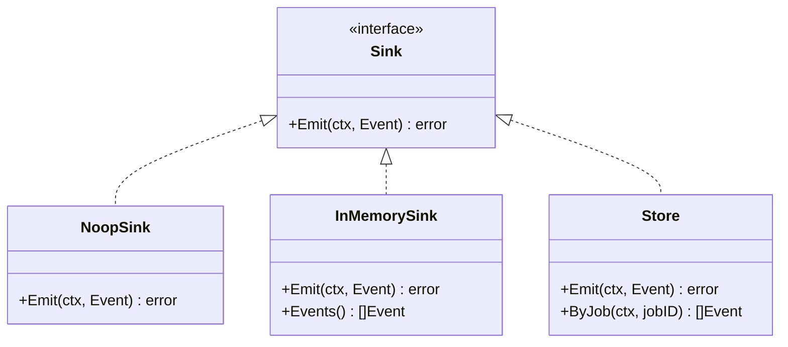

# Events (`internal/event`)

`internal/event` defines ServerVault's structured, append-only
operational record: what happened, when, to which job, with what safe
metadata. See [`docs/core-infrastructure.md`](core-infrastructure.md) for
why this package exists as shared foundation.

## Not event sourcing

Events are a record of what happened, not the source of truth
application state is reconstructed from. `internal/job`'s SQLite-backed
`Job` rows remain authoritative for "what state is this job in right
now" — events are operational history alongside that, not instead of it.
A full event-sourcing model (where replaying the event log is how state
is derived) was considered and declined: the audit-log use cases this
package needs to serve — "show me every event for job X," "what
happened to this policy" — are fully served by a normal append-only
table, and event sourcing is a materially larger architectural
commitment than that calls for.

## Not a replacement for `log/slog`

`log/slog` remains how ServerVault writes operator-facing diagnostic
text (see `CLAUDE.md`'s logging rules). Events are a separate, small,
typed, queryable record meant to be listed and filtered — kept
deliberately independent so persisting an event never depends on the
current log level, and so slog output can stay verbose or terse without
affecting what's in the operational history.

## Event types

| Type | Meaning |
| --- | --- |
| `job.created` | A job was created. |
| `job.started` | A job left `pending` for `preparing`. |
| `database_dump.started` / `.completed` | A database dump phase began/ended. |
| `backup.started` / `.completed` | A Restic backup phase began/ended. |
| `verification.started` / `.completed` | A verification phase began/ended. |
| `restore.planned` | A restore plan was generated (see `docs/restore-flow.md`). |
| `restore.started` / `.completed` | A restore execution began/ended. |
| `job.failed` / `.cancelled` / `.interrupted` | A job reached that terminal state. |

`Type` is a closed, typed set (`type Type string` with named constants),
not an arbitrary string — a typo in a call site is a compile error, not
a silently-unmatched event nobody ever queries for.

## Schema

`Metadata` is a closed, typed struct — the same pattern as
`internal/job.Metadata` and for the same reason: no generic
`map[string]string` field exists anywhere in this package's public API,
so a caller cannot accidentally attach a password, token, or
credential-bearing URL to a persisted event. See
[`docs/core-infrastructure.md`](core-infrastructure.md#safety-no-secrets-in-persisted-state).

## Sinks

`Sink` has exactly one method, `Emit` — no `Update`, no `Delete` — which
is enforced structurally (`TestEventSink_HasNoMutationMethods` reflects
over the interface itself, not just `Store`'s implementation) as the
append-only contract this package promises.

- **`NoopSink`** discards every event; the safe default for callers that
  haven't configured event persistence.
- **`InMemorySink`** collects events in memory, safe for concurrent use;
  used in tests.
- **`Store`** persists events to SQLite (WAL mode, pure-Go driver, the
  same pattern as `internal/job.Store`). It can point at the same
  database file an `internal/job.Store` is using — see
  `TestStore_SharesFileWithJobStore`.

## What consumes this package

`internal/restore` (v0.4.0-alpha.1, this session) is the first real
production consumer, emitting `restore.planned`/`.started`/`.completed`
around each restore operation. The platform's audit log (a later
milestone in the wider roadmap) is designed to expose this same stream
over the API, rather than inventing a parallel audit mechanism.
