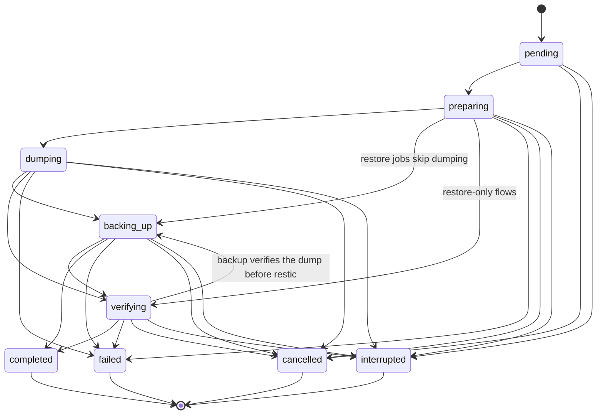

# Job lifecycle (`internal/job`)

`internal/job` defines the states a backup, restore, or prune run passes
through and which transitions between them are legal. It is pure
state-machine and persistence logic — it knows nothing about restic,
PostgreSQL, Cobra, or HTTP. See [`docs/core-infrastructure.md`](core-infrastructure.md)
for why this package exists as shared foundation.

## States

| State | Meaning |
| --- | --- |
| `pending` | Created, not yet started. |
| `preparing` | Validating preconditions (lock, connectivity, config) before doing real work. |
| `dumping` | A database dump is in progress (backup jobs with a database enabled). |
| `backing_up` | Files are being written to or read from Restic — the "doing the actual restic operation" phase for both backup and restore jobs. |
| `verifying` | Post-operation verification (dump validity, restic check). |
| `completed` | Finished successfully. Terminal. |
| `failed` | Finished unsuccessfully. Terminal. |
| `cancelled` | Explicitly cancelled (operator or context cancellation). Terminal. |
| `interrupted` | The process that owned this job exited without reaching a terminal state — reconciled automatically on the next `Store.Open`. Terminal. |

Once a job reaches any of the four terminal states, it never transitions
again — `Store.Advance` rejects the attempt with a `*TransitionError`. An
interrupted job is not resumed in place; a fresh job is created for a
retry.

## State diagram

`dumping` and `backing_up` are both reachable directly from `preparing`
because not every job type visits every state: a restore-to-staging job
has no database dump phase, so it goes straight to `backing_up` (the
"performing the restore" phase); a backup job with PostgreSQL enabled
visits `dumping` first.

`verifying` has two legal exits for the same reason: `internal/restore`
verifies *after* its write (`verifying → completed` only — confirming a
restore landed correctly), while `internal/backup` verifies *before* its
write (`verifying → backing_up` — confirming a dump is valid before
handing it to Restic, then actually backing it up). Both are real,
already-shipped control flow; the graph supports both orderings rather
than forcing one consumer's step sequence onto the other.

## Persistence

`Store` (an `internal/job` type) persists every job to a local SQLite
database, opened in WAL mode via a pure-Go driver
(`modernc.org/sqlite` — no cgo, keeping the static-binary build intact).
Every write goes through a single pooled connection
(`db.SetMaxOpenConns(1)`), which is what makes concurrent
`Store.Advance` calls safe without an additional in-process mutex — see
`store.go`'s doc comment for the full reasoning.

State transitions are validated twice: once against the in-memory state
graph (`CanTransition`), and once at the database layer via an optimistic
compare-and-swap on an internal `row_version` column. A transition that
loses the race (another writer already changed the row) returns
`ErrConcurrentUpdate`, not a silently-dropped write.

## Crash consistency and reconciliation

`internal/job` makes two guarantees, tested for real (not just asserted)
in `store_test.go`:

1. **The database file survives an unclean process exit.** SQLite's WAL
   journaling provides the underlying durability guarantee — that is
   upstream, well-established behavior this package relies on rather than
   re-tests. What this package's own test suite verifies is that
   `TestStore_ReconcileAfterUncleanRestart` spawns a real subprocess,
   has it create a job, advance it into a non-terminal state, and send
   itself `SIGKILL` with no graceful shutdown of any kind — then reopens
   the same file in the parent test process and confirms `Open` and `Get`
   both succeed.
2. **An orphaned in-progress job is reconciled predictably.**
   `Store.Reconcile`, intended to be called once right after `Open` by
   whichever process owns the store's file, marks every job left in a
   non-terminal state as `interrupted`. There is no ambiguity about
   "was this job still running" — if the store's own file is being
   opened fresh, nothing else is still writing to it.

## Metadata: a closed set of safe fields

`job.Metadata` has a fixed list of named fields (snapshot ID, database
name, byte counts, file counts, and so on) — there is no
`map[string]string` and no generic setter. See
[`docs/core-infrastructure.md`](core-infrastructure.md#safety-no-secrets-in-persisted-state)
for why.

## What consumes this package

- `internal/backup` (`Engine.Run`, v0.3.0 Phase A) routes every backup
  through this package's state machine and emits structured events at
  each phase -- see [`docs/backup-flow.md`](backup-flow.md)'s Go-engine
  section. Job/event tracking is optional at the `Engine` level (see
  `backup.WithJobStore`/`backup.WithEventSink`): a caller that doesn't
  configure either still gets a fully working backup, just untracked --
  see that package's doc comment for the "degrades safely, never fails
  closed at runtime" policy.
- `internal/restore` (a sibling milestone, `v0.4.0-alpha.1`) is the
  other real production consumer, requiring a job store unconditionally
  (fails closed at construction, unlike backup's optional wiring) since
  restore's cleanup-ownership tracking depends on it more directly.
- The local agent daemon (v0.9.0, a later milestone) is expected to reuse
  this package's `JobHistory` unchanged.
