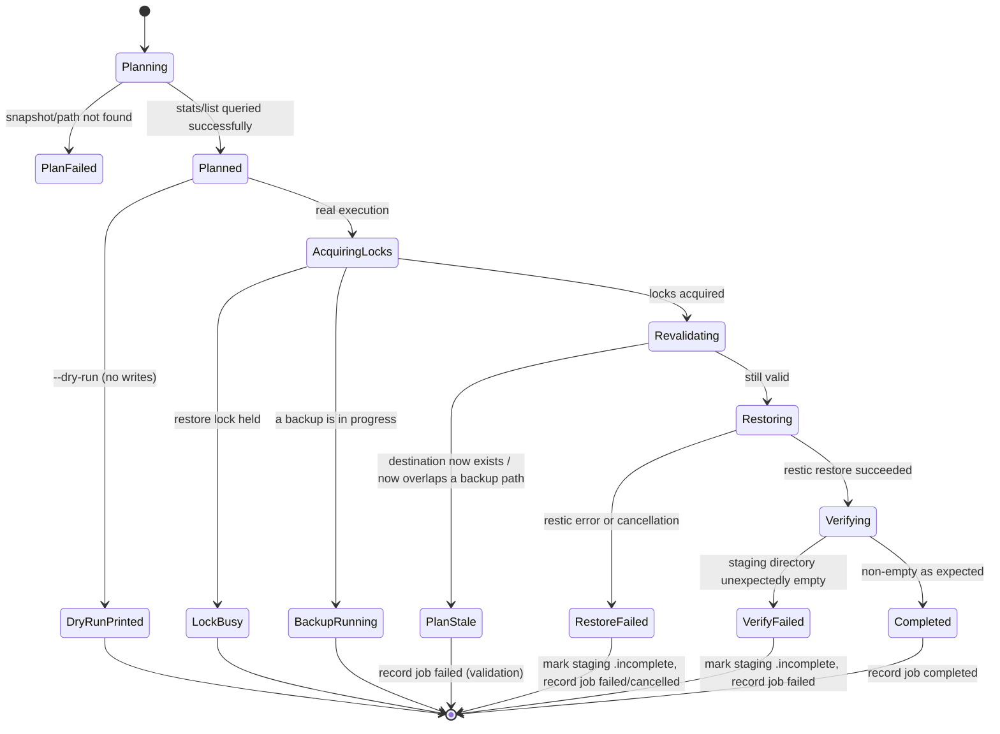
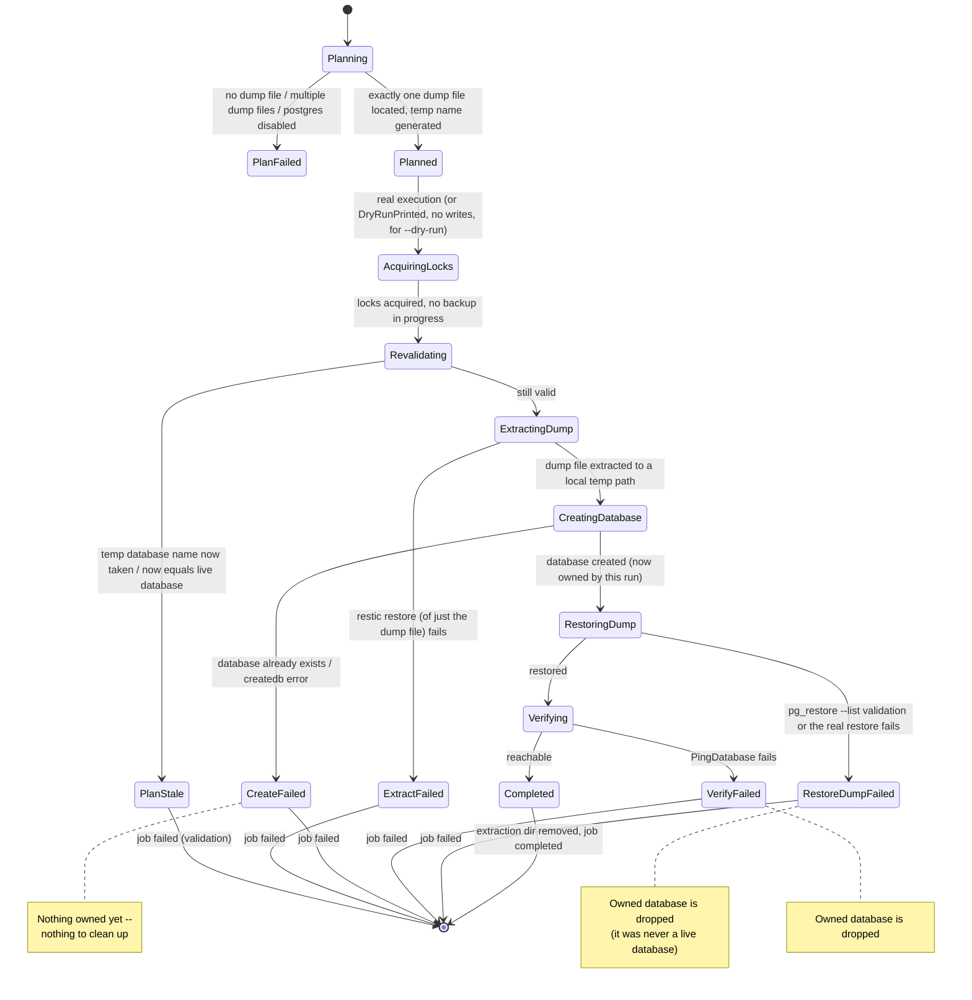

# Restore flow

This describes the `servervault-restore` shell script (`main`) and,
below, the Go rewrite's `servervault restore` (`go-rewrite`,
v0.4.0-alpha.1), which follows the same staging-first, temp-database-
first defaults through `internal/restore`.

## Guiding rule

**Restores never overwrite live data by default.** Files are restored
into a new, timestamped directory; databases are restored into a new,
temporary database. Promoting a restore to "live" is a separate,
explicit, human step that this tool does not perform automatically.

## Menu

Running `servervault-restore` presents:

1. **List snapshots** — `restic snapshots --tag=servervault`. Read-only.
2. **Restore latest snapshot to a safe directory** — creates
   `$RESTORE_ROOT/latest-<timestamp>/` and restores into it.
3. **Restore a specific snapshot to a safe directory** — same as (2),
   but prompts for a snapshot ID first.
4. **Extract latest PostgreSQL dump** — restores only the `*.dump.zst`
   file from the latest snapshot into
   `$RESTORE_ROOT/database-<timestamp>/`, decompresses it, and runs
   `pg_restore --list` against it to confirm the archive is valid
   before declaring success.

Every restore target is a fresh, uniquely named directory under
`RESTORE_ROOT` — nothing is restored in place.

## Restoring the database for real

Extracting the dump (menu option 4) only verifies and stages it. To
apply it, restore into a **new** database first, exactly as in the
[disaster recovery guide](disaster-recovery.md):

```bash
sudo -u postgres createdb app_restore_test
sudo -u postgres pg_restore --clean --if-exists --no-owner \
  --dbname=app_restore_test /path/to/extracted.dump
```

Validate the restored data in `app_restore_test`, then cut the
application over to it (rename, or repoint the connection string) only
once you're satisfied — ServerVault does not do this step for you.

## Restoring files for real

Compare the staged restore directory against the live path (`diff -rq`,
or review the specific files you need) and copy over only what you've
validated. Do not `rsync --delete` a staged restore straight onto a
live path without review.

## Go engine (`go-rewrite`, v0.4.0-alpha.1)

`servervault restore` implements the same staging-first, temp-database-
first guarantees as the shell script above, through `internal/restore`,
backed by `internal/restic`'s `Restore`/`Stats`/`List` methods and
`internal/postgres`'s `RestoreToTemp`. Planning is a separate, read-only
step from execution: `Planner.Plan` never writes anything, and
`Executor.Execute` re-validates the plan's critical assumptions (the
destination doesn't already exist, the temporary database name doesn't
already exist and isn't the live database) again immediately before the
first write, in case something changed in the gap between planning and
execution.

```bash
servervault snapshots

servervault restore --snapshot <id> --target files [--path <repo-path>] [--dry-run]
servervault restore --snapshot <id> --target temp-db [--dry-run]

# Non-interactive (e.g. scripted DR drills): --yes skips the
# confirmation prompt, matching CLAUDE.md's "destructive-sounding
# execution requires explicit confirmation" rule -- a script that omits
# both an interactive terminal and --yes is treated as not confirmed,
# never silently proceeds.
servervault restore --snapshot latest --target temp-db --yes --output json
```

### Planning: real repository metadata, never guessed

`Planner.Plan` queries the repository itself (`restic stats`/`restic
ls`) to populate a Plan's expected file count and byte size — a
`--dry-run` invocation's output is exactly what a real execution would
report, not an estimate. For `--target temp-db`, the planner also
locates the snapshot's PostgreSQL dump file by listing the configured
dump directory within that snapshot: if none is found (the snapshot was
taken with PostgreSQL disabled) or more than one is found (an
unexpected repository layout), planning fails outright rather than
guessing which file to restore.

### File restore flow



A failed or cancelled file restore never deletes the staging directory:
a `.incomplete` marker file is written into it instead (see
`markIncomplete` in `internal/restore/executor.go`) so a partially
restored directory is clearly distinguishable from a complete one,
without discarding whatever *did* make it to disk before the failure —
staging is inert by construction, so there's nothing unsafe about
leaving a partial result there for an operator to inspect.

### Database restore flow



The temporary database is only ever dropped by ServerVault's own cleanup
path if *this run* created it (tracked as a simple `owned` boolean the
moment `CreateDatabase` succeeds — see `executeTempDB`). A database that
already existed before this run started is never touched, and the live
database configured in `postgres.database` has no code path that ever
targets it for restore at all — `RestoreToTemp` only ever accepts the
freshly generated temporary name.

### Cancellation and cleanup

Every exit path — success, any failure, or `ctx` cancellation —
releases the restore lock and records a terminal job state. Cleanup
operations themselves (dropping an owned temporary database, recording
the job's terminal state) run under a context that carries the
original's values but is never itself cancelled
(`context.WithoutCancel`), specifically so that cancellation — the
reason cleanup is needed — can't also be the reason cleanup fails to
run. A cancelled restore's job ends in the `cancelled` state, distinct
from `failed`, so operators and future tooling can tell "the operator
stopped this" apart from "this broke."

### Coordinating with backups

Restore acquires its own dedicated lock (`restore.lock_file`), separate
from the backup lock, so two concurrent restores can't collide. Before
starting, it also checks whether the *backup* lock is currently held; if
a backup is in progress, restore refuses to start (`ErrBackupInProgress`)
rather than queue or run alongside it. This is a deliberately
conservative choice given genuinely ambiguous requirements: restic's own
per-repository locking already prevents an unsafe concurrent
backup+restore at the repository level, so the check here isn't
protecting the repository itself — it's avoiding the operational
confusion of a restore and a backup writing to the local filesystem
(`backup.root`'s dump directory vs. a fresh staging directory) at the
same moment. Revisit if this proves too conservative in practice.

### What `internal/restic` still refuses to do

Restore (staging-only, see above) is the one deliberate, scoped addition
to `internal/restic` beyond what Phase A shipped — see that package's
doc comment. `Init`, `Forget`/`Prune`, and `Unlock` remain entirely
absent from the package; retention (`servervault prune`) is a later
milestone.
