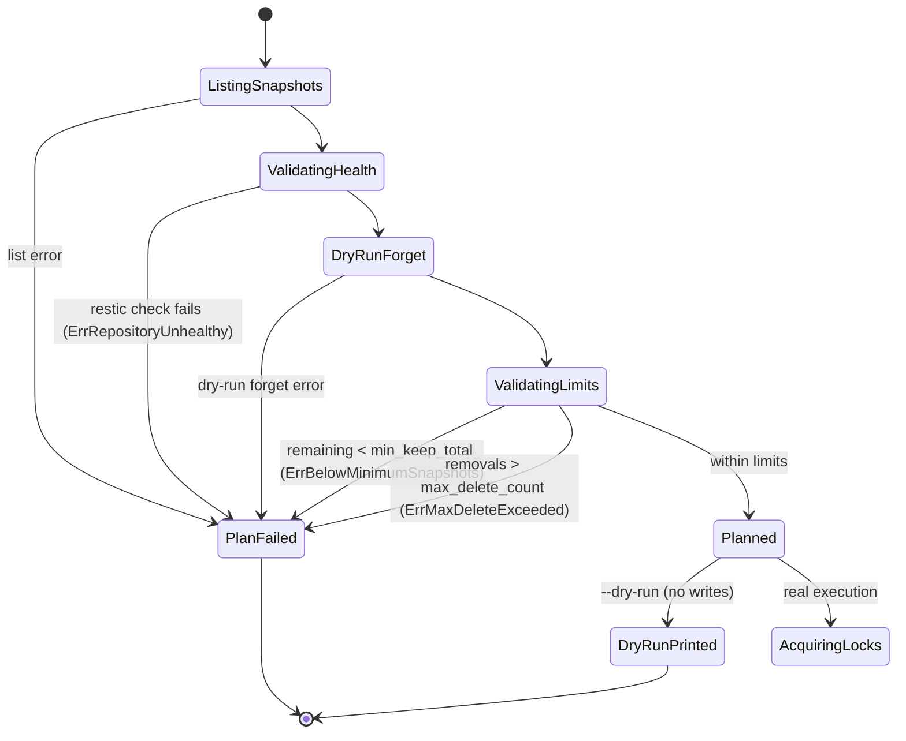
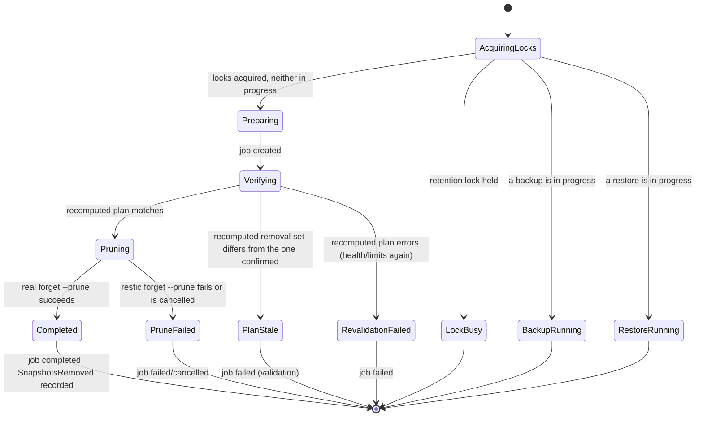

# Retention flow

This describes `servervault prune` (`go-rewrite`, v0.5.0), implemented
through `internal/retention`, backed by `internal/restic`'s new
`Snapshots`/`Check`/`Forget` methods. It follows the same
planning-is-separate-from-execution shape `internal/restore` established
in v0.4.0-alpha.1, applied to ServerVault's most destructive operation:
removing snapshots.

## Guiding rule

**Retention must never delete unexpectedly.** Every prune is bounded by
two independent, configurable safety limits (a floor on remaining
snapshots, a ceiling on how many may be removed in one run), gated on a
repository health check, and — outside `--dry-run` — requires either
`--yes` or an interactive `"yes"` confirmation. Planning a prune never
writes anything; only `Execute` can, and only after re-confirming its
own plan is still accurate immediately beforehand.

## Command

```bash
servervault prune [--dry-run] [--yes] [--output text|json]
```

Unlike the shell implementation's `servervault-backup` (which runs
`restic forget --prune` automatically at the end of *every* backup),
the Go engine's retention is a **separate, explicit command**. This is
a deliberate parity deviation, not an oversight: `CLAUDE.md`'s
non-negotiable safety rules for the Go rewrite (explicit confirmation
for destructive actions, dry-run support) apply across the board, the
same way `servervault restore` already diverges from the shell's
interactive-menu restore tool. Retention *policy* (keep_daily/weekly/
monthly, host/tag scoping) has full parity with the shell script —
see `docs/configuration.md`; retention *execution model* does not.

Exit codes: `0` success (including a completed `--dry-run`, and a
`--yes`-free run where nothing was eligible for removal), `1` the
prune itself failed or was refused (lock busy, a safety limit refused
the plan, not confirmed), `2` config or usage error.

## Planning: real repository metadata, never guessed

`Planner.Plan` performs no writes. In order:

1. **List current snapshots** (`restic snapshots --host <host_tag>
   --tag servervault ...`) — establishes `CurrentSnapshotCount`.
2. **Validate repository health** (`restic check`) — `CLAUDE.md` rule
   7, "refuse destructive cleanup if repository validation fails."
   Nothing below this step runs if it fails.
3. **Compute the removal set** via a real `restic forget --dry-run
   --json` against the configured `keep_daily`/`keep_weekly`/
   `keep_monthly` policy. This is restic's own retention decision,
   not reimplemented — Plan asks restic what it would do and reports
   that, the same "never guessed" principle `internal/restore`'s
   Planner already applies to `restic stats`/`restic ls`.
4. **Validate the removal set** against two independent limits:
   - `retention.min_keep_total` — the remaining count
     (`CurrentSnapshotCount - RemoveCount`) must be at or above this.
     `config.Validate` enforces a floor of 1 on the configured value
     itself: retention can never be configured to prune a repository
     to zero snapshots.
   - `retention.max_delete_count` — `RemoveCount` must be at or below
     this. No "unlimited" value exists; this is what turns a
     catastrophic keep-policy misconfiguration (e.g. `keep_daily`
     accidentally set far too low) into a refused run with a specific
     error instead of a silent mass deletion.

A `Plan` is only ever returned once every step above has passed.



## Execution: revalidate, then the one destructive call



`Executor.Execute` acquires a dedicated `retention.lock_file`, then
checks **both** the backup lock and the restore lock's status (not just
the backup lock, which is all `internal/restore` checks) — refusing to
run if either is held. Forget/prune is the most destructive of
ServerVault's three operations; checking both locks is a deliberately
more conservative choice than restore's, matching the requirement's
"if any destructive behavior is uncertain, choose the safer
implementation."

Once a job record exists, Execute **recomputes the entire plan from
scratch** — the same list → check → dry-run-forget → limit-validation
pipeline `Plan` itself runs — immediately before the one call that
actually removes anything. If the recomputed removal set doesn't match
what was confirmed (a backup created a new snapshot in the gap, another
prune already ran, the repository's health changed), Execute fails with
`*ErrPlanStale` rather than proceeding on a decision that may no longer
be accurate. This mirrors `internal/restore`'s Executor revalidating its
own critical assumptions (destination doesn't already exist) immediately
before its first write.

Only after revalidation passes does Execute call `restic forget --prune`
for real.

### Job/event lifecycle

States reuse `internal/job`'s existing graph unchanged —
`preparing → verifying → backing_up → completed` (or → `failed`/
`cancelled` from any non-terminal state). This isn't a stretch:
`internal/restore` already overloads `StateBackingUp` to mean "the
primary write operation is executing," and `internal/job`'s own package
doc comment already names "backup, restore, or prune" as this state
machine's three consumers. `Verifying` covers both the health check and
the revalidation dry-run; `BackingUp` covers the real, destructive
`forget --prune` call specifically.

Events: `retention.planned` (emitted at job creation, carries the
originally-planned `SnapshotsRemoved` count), `retention.started`,
`retention.completed` (carries the actually-removed count) — mirroring
`restore.planned`/`started`/`completed` exactly.

Job/event tracking is **required, not optional** for retention — the
same asymmetry `internal/restore` already has relative to
`internal/backup` (see `docs/core-infrastructure.md`), for the same
reason: an unconditional audit trail matters more for a destructive
operation than it does for backup's core safety properties.

## Safety limits, summarized

| Limit | Config field | Default | Enforced by |
| --- | --- | --- | --- |
| Keep-policy (which snapshots restic would remove) | `retention.keep_daily`/`keep_weekly`/`keep_monthly` | 7 / 4 / 12 | restic itself, via `forget`'s own policy evaluation |
| All-zero keep policy rejected | (derived) | n/a | `config.Validate` |
| Minimum remaining snapshots | `retention.min_keep_total` | 1 | `config.Validate` (floor of 1, unconditionally) + `Planner.Plan` |
| Maximum removals per run | `retention.max_delete_count` | 50 | `config.Validate` (must be > 0, no unlimited value) + `Planner.Plan` |
| Repository health | n/a | n/a | `restic check`, in `Planner.Plan` |
| Concurrent prune runs | `retention.lock_file` | `/run/lock/servervault-prune.lock` | `internal/lock`, in `Executor.Execute` |
| Concurrent backup | `backup.lock_file` (status only) | n/a | `Executor.Execute` |
| Concurrent restore | `restore.lock_file` (status only) | n/a | `Executor.Execute` |
| Explicit confirmation | `--yes` / interactive prompt | n/a | `internal/cli/prune.go` |
| Plan/execute drift | n/a | n/a | `Executor.Execute`'s revalidation |

## Known limitation: bytes reclaimed is not reported

`restic forget --prune --json` carries pruning statistics (bytes
reclaimed), but the exact shape of that output was not verified against
a real restic binary in the environment this code was written in (no
restic installed there — the same constraint noted throughout
`docs/testing.md`). Rather than parse a field that could silently
misreport — the same class of mistake that caused a real bug in the
temp-database restore path earlier in this project's history — `Forget`
reports only snapshot IDs kept/removed, which are parsed from restic's
well-documented, stable `--json` group format used identically for a
plain `forget` and a `forget --prune`. `servervault prune`'s output
(text or `--output json`) does not include a bytes-reclaimed figure as
a result. Revisit once verified against a real restic instance (the
`restic-integration` CI job, once it runs, is the first real
verification opportunity).

## What `internal/restic` still refuses to do

`Init` and `Unlock` remain entirely absent from the package. `Forget`
(this milestone) and `Restore` (v0.4.0-alpha.1) are the two deliberate,
scoped exceptions to `internal/restic`'s "never delete a repository"
design — see that package's doc comment. Neither enforces ServerVault's
own safety policy itself; that lives in the calling package
(`internal/retention`, `internal/restore`), not in `internal/restic`.
