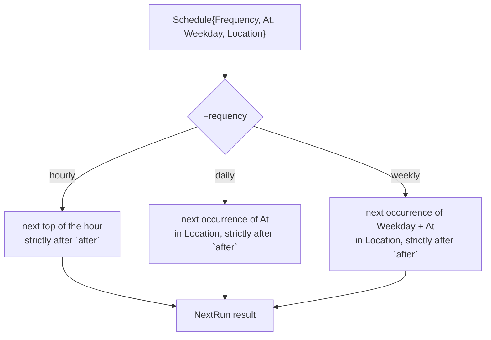
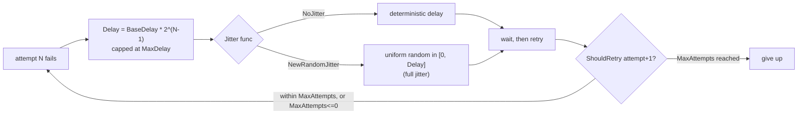

# Scheduler and retry (`internal/scheduler`)

`internal/scheduler` computes when a named, recurring job should next
run and how long to wait before retrying a failed one. It contains no
daemon loop, no ticker, and no goroutine — it is pure calculation,
consumed by a daemon (the local agent, v0.9.0) rather than being one
itself. See [`docs/core-infrastructure.md`](core-infrastructure.md) for
why this package exists as shared foundation.

## Why not a cron expression parser

Schedules are a small, explicit structure — frequency, time-of-day,
weekday, IANA location — rather than a general cron expression string.
A hand-rolled cron parser is real correctness risk, especially around
DST, for a feature set the roadmap only ever needs ("daily/weekly/hourly
at a given wall-clock time"). Adding a third-party cron library was
considered and declined per the project's "avoid unnecessary
dependencies" default; if a genuine need for arbitrary cron expressions
appears later, that is its own scoped addition, not a retrofit of this
type.

## Next-run calculation

`Location` is required — never an implicit "local time" — so a
schedule's meaning does not silently change if the process running it
moves to a host with a different system timezone. DST transitions are
handled by Go's own `time.Date` normalization rules (documented,
deterministic behavior for both the spring-forward gap and the
fall-back overlap), not by this package's own arithmetic — see
`scheduler_test.go`'s `TestSchedule_NextRun_DST_SpringForward` and
`TestSchedule_NextRun_DST_FallBack`, which assert against a real
`America/New_York` transition rather than a synthetic one.

## Missed-run handling

There is no implicit default baked into `NextRun` for what happens if
the agent was down when a schedule should have fired. `Schedule.CatchUp`
requires the caller to choose a `MissedRunPolicy` explicitly:

- **`MissedRunSkip`** (the common default for routine backups) — report
  how many occurrences were missed, but only surface the next *future*
  occurrence. Running three days of missed backups back to back is
  rarely useful.
- **`MissedRunRunOnce`** — if at least one occurrence was missed, report
  that the caller should run immediately (once, not once per missed
  occurrence), then resume the normal schedule from there.

## Retry and backoff

`RetryPolicy.Delay` is bounded exponential backoff:
`BaseDelay * 2^(attempt-1)`, capped at `MaxDelay`, then passed through a
`JitterFunc`. Jitter is injectable specifically so tests can be
deterministic: `NoJitter` returns the computed delay unchanged, while
`NewRandomJitter(r *rand.Rand)` implements the "full jitter" algorithm
against a caller-supplied random source — a fixed-seed source in tests
(`TestRetryPolicy_Delay_DeterministicJitterIsReproducible` proves two
same-seed policies produce identical sequences), a time-seeded one in
production.

## Concurrency limits

`ConcurrencyLimit{Max int}` is a representable value only in this
milestone — `Allow(current int) bool` is a pure function with no state of
its own. Enforcing it against real running jobs (tracking how many are
currently in flight) is the local agent daemon's responsibility, a later
milestone; this package just makes the limit expressible and testable in
isolation.

## What consumes this package

The local agent's `LocalScheduler` (v0.9.0) and, later, the control
plane's remote job queue (v1.2.0 in the wider platform roadmap) are both
expected to reuse `Schedule.NextRun`, `Schedule.CatchUp`, and
`RetryPolicy.Delay` unchanged rather than reimplementing schedule math
independently.
